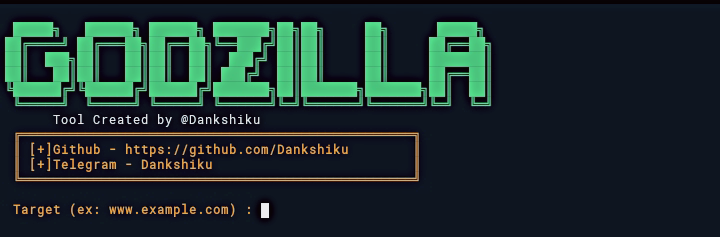

<p align="center">

  

</p>

##

<h3>Godzilla</h3>

Godzilla is basically an HTTP Denial of Service attack that affects threaded servers. It works like this:

We start making lots of HTTP requests.

1. We send headers periodically (every ~15 seconds) to keep the connections open.

2. We never close the connection unless the server does so. If the server closes a connection, we create a new one keep doing the same thing.

3. This exhausts the servers thread pool and the server can't reply to other people.

### Installation 

- Just, Clone this repository -

```

$ git clone https://github.com/Dankshiku/Godzilla

```

- Change to cloned directory and run `python Godzilla.py` 

```

$ cd Godzilla

$ bash install_termux.sh

$ python Godzilla.py

```

### Required Tools

`slowloris`

Slowloris is a type of denial of service attack tool which allows a single machine to take down another machine's web server with minimal bandwidth and side effects on unrelated services and ports. Slowloris tries to keep many connections to the target web server open and hold them open as long as possible. 

`Nmap `
 
 Nmap is a network scanner created by Gordon Lyon. Nmap is used to discover hosts and services on a computer network by sending packets and analyzing the responses. 
 
 `Nikto`
 
Nikto is an open-source website vulnerability scanner, it performs comprehensive tests on servers in several directions, including more than 6,700 potentially dangerous files/programs, checking for outdated versions of more than 1250 servers and problems specific to versions of more than 270 servers. The scanner also checks server configuration items, such as the presence of multiple index files, HTTP server options, and tries to determine the name and version of the webserver and software

### Screenshot

<p>

  

</p>

### Find Me on :

<p align="left">

  <a href="https://github.com/Dankshiku" target="_blank"></a>

  <a href="https://www.instagram.com/Dankshiku" target="_blank"></a>

  <a href="https://m.me/Dankshiku" target="_blank"></a>

</p>

